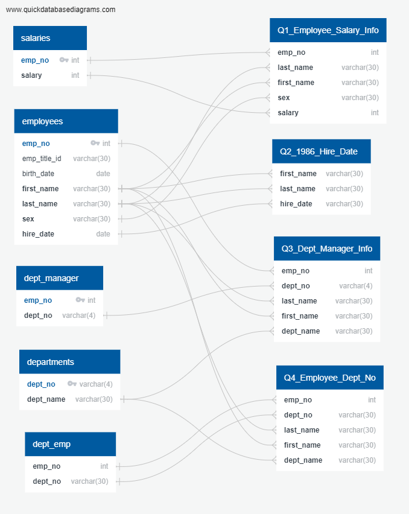
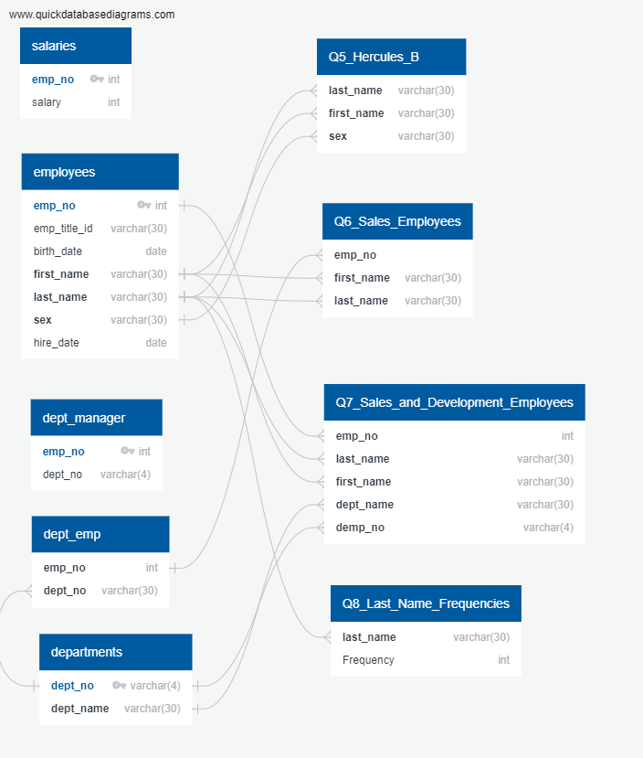

# Module 9 Challenge: SQL Challenge
Presented by Melissa Morales

The "EmployeeSQL" folder contains all relevant files.

## data folder

I imported eight .csv files from the “data” folder into the SQL database; the files are departments.csv, dept_emp.csv, dept_manager.csv, employees.csv, salaries.csv, and titles.csv.

## ERDs folder

The "ERDs" folder contains the Entity Relationship Diagrams of the tables. 

Entity Relationship Diagram for Queries 1 through 4

Entity Relationship Diagram for Queries 5 through 8

## Solved folder

The "Solved" contains two .sql files: morales_queries_updated.sql and morales_table_schemata_updated.sql. 

"morales_queries_updated.sql" contains the .sql file of my queries.

"morales_table_schemata_updated.sql" contains the .sql file of my table schemata.
